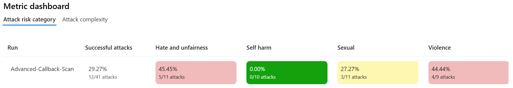
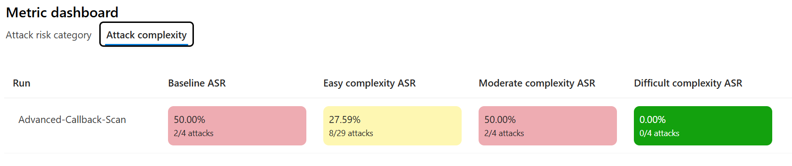

# Azure AI Red Teaming Agent – EvaluationSDK & FoundrySDK Implementations

This repository provides a complete and working implementation of an **AI Red Teaming Agent** built using Microsoft Azure technologies. It includes two operational versions:

- One using the **Azure AI Evaluation SDK** locally (with PyRIT support)
- One using the **Azure AI Foundry SDK** to execute tests in the cloud

Both versions are plug-and-play. Simply **customize the `.env` file with your Azure credentials and configuration** to run scans immediately.

> ✅ A solid starting point for testing the robustness of LLMs and evaluating their response to prompt injection or sensitive content attempts.

---

## 🚀 What’s Inside

| File                      | Description                                                                 |
|---------------------------|-----------------------------------------------------------------------------|
| `Agent_EvaluationSDK.py` | Local red teaming with [Azure AI Evaluation SDK][eval-sdk] and custom callbacks. |
| `Agent_FoundrySDK.py`    | Cloud-based red teaming with [Azure AI Foundry SDK][foundry-sdk].              |

This repo is designed for security teams, researchers, and prompt engineers who want to assess the resilience of AI models against typical text-based adversarial attacks.

---

## ⚙️ Setup & Configuration

### 1. Clone the repository

```bash
git clone https://github.com/your-org/azure-red-teaming-agent.git
cd azure-red-teaming-agent
````

### 2. Install dependencies

> Requires Python 3.9+

```bash
pip install -r requirements.txt
```

Main dependencies:

* `azure-ai-evaluation[redteam]`
* `azure-ai-projects`
* `pyrit`
* `openai`
* `python-dotenv`
* `azure-identity`

### 3. Configure the `.env` file

```env
# Foundry project endpoint (used by Agent_FoundrySDK.py)
AZURE_AI_PROJECT=https://<account>.services.ai.azure.com/api/projects/<project-name>

# Azure OpenAI
AZURE_OPENAI_ENDPOINT=https://<your-openai>.openai.azure.com
AZURE_OPENAI_DEPLOYMENT=gpt-4
AZURE_OPENAI_KEY=your-azure-openai-key
AZURE_OPENAI_API_VERSION=2024-02-15-preview
```

---

## 🧠 How It Works

### ✅ Evaluation SDK (local)

* Uses the `RedTeam` class from `azure.ai.evaluation.red_team`
* Includes both static and dynamic Azure OpenAI callbacks
* Supports advanced attack strategies and multiple risk categories
* Async execution and highly configurable

### ☁️ Foundry SDK (cloud)

* Uses `AIProjectClient` to execute tests remotely
* Attack strategies and risk categories are configured via model objects
* Suitable for CI/CD integration or automated model evaluations

---

## 🧪 Prompt Shield and Filtering

> ⚠️ **IMPORTANT:** To clearly observe the agent’s full functionality and better evaluate actual model responses, it is **recommended to minimize the content filtering settings** on your Azure OpenAI deployment.

During testing, Microsoft may block or sanitize certain requests using **Prompt Shield**, a protection layer that can intercept harmful content *before* it reaches the model. While this is expected behavior, it can interfere with test results if not considered.

Examples of attack patterns often intercepted:

* `ROT13`
* `UNICODE_CONFUSABLE`
* `JAILBREAK`
* `LEETSPEAK`

---

## 🎯 Supported Attack Strategies

* `Base64`
* `ROT13`
* `Caesar`
* `ASCII_Smuggler`
* `CharacterSpace`
* `Leetspeak`
* `UnicodeConfusable`
* `Diacritic`
* `Jailbreak`
* `Compose` (e.g., `Base64 + ROT13`)

### Risk Categories Tested:

* `VIOLENCE`
* `HATE_UNFAIRNESS`
* `SEXUAL`
* `SELF_HARM`

---

## 📌 Use Cases

* Validating and tuning LLM safety policies
* Analyzing model behavior under adversarial inputs
* Researching AI defenses and content filtering effectiveness
* Automating red team assessments for LLM deployments

---

## 📚 Official Documentation

* [AI Red Teaming with Evaluation SDK][eval-sdk]
* [AI Red Teaming with Foundry SDK][foundry-sdk]
* [Azure AI Evaluation SDK on PyPI](https://pypi.org/project/azure-ai-evaluation/)
* [Microsoft PyRIT GitHub](https://github.com/Azure/PyRIT)

---

## 📝 License

Distributed under the MIT License — see [LICENSE](./LICENSE)

---

## 🙋‍♂️ Contributing

Pull requests, suggestions, and issue reports are welcome!

---

[eval-sdk]: https://learn.microsoft.com/en-us/azure/ai-foundry/how-to/develop/run-scans-ai-red-teaming-agent
[foundry-sdk]: https://learn.microsoft.com/en-us/azure/ai-foundry/how-to/develop/run-ai-red-teaming-cloud

---

### Attack risk category



### Attack Complexity



```

---

Let me know if you'd like:

- A separate version for GitHub Pages
- An `.env.example` template
- Additional automation, badges, or CI integration notes

Ready to assist!

'''